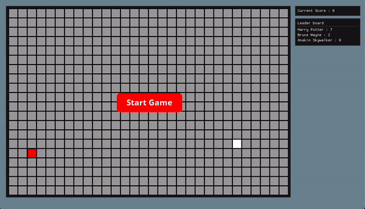

# Beryllium
OpenGL and GLFW based game engine with rendering performance

    

## A Learning Journey

Hi! Thanks for taking a look at this project. This project took me about three weeks to make.

My goal doing this project was to build a game without a game engine. I honestly didn't expect that it was going to be this complicated. A game as simple as this one contains sound, input handling, rendering, state management, UIs, a game loop, cross-compatibility etc.

I had to make difficult choices during the process. I didn't have that much experience with game engine architectures so my mindset was "let's just do something that works and then fix it later". However, because of this, I made terrible architectural mistakes at the beginning it made it super hard to continue the developpement.

I'm also using cpp which makes things a whole lot more complicated. I wanted to make this project cross-compatible, and every time that I would switch between platforms, I would find new issues with the project. Anyway, in terms of code quality, it's probably the thing that I'm the least proud of.

If I could make this project again, I probably would choose to implement a whole lot more design patterns. For instance, I could use State to manage the stage machine of the snake.
I would also use Dispatcher to handle the UI. In terms of the rendering pipeline, I would do things in a different way. At the moment, the project is heavily coupled with GLFW, OpenGL and ImGui. I would definitely create an abstraction layer in the future to avoid this kind of inflexibility.

## How to build locally

This project uses `CMake`. I personally used the `CMake GUI` to `Configure` and `Generate` the project. By the end of the project I realized that the integration of the OpenAL library broke the command line `mkdir build && cd build && cmake .. && make`. This might be fixed later, but at the moment, I suggest you use the `CMake GUI`.

1. Select `Berylllium/Berrylium` as the source directory
2. Select `Beryllium/Beryllium/build` as the output directory
3. Press on the `Configure` button (don't touch to the configuration macros)
4. Press on the `Generate` button.

You should now have a project that works on all platforms..

